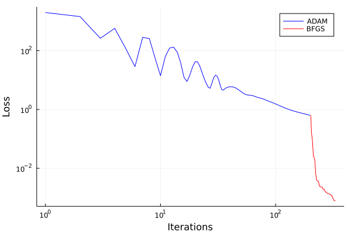
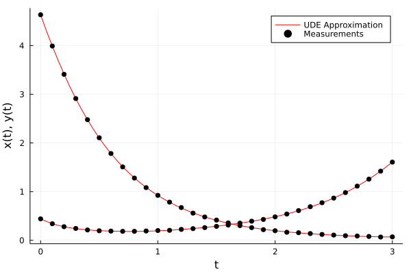
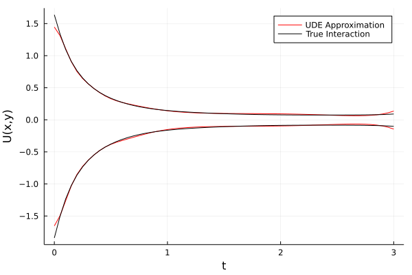
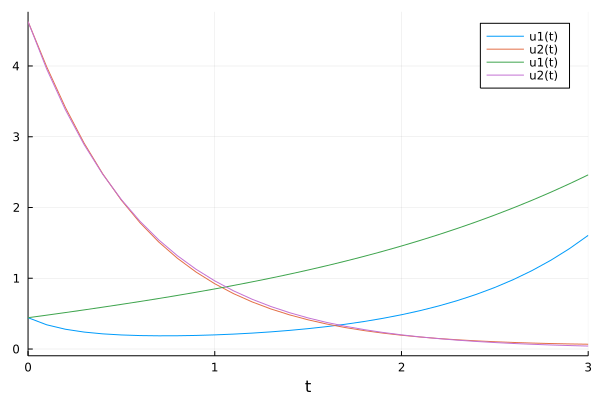

# SciML Sensitivity Optimizers + Symbolic recovery in Julia


## Introduction

In this tutorial, we will look at:

(a) How optimizers can be grouped together to solve an inverse problem efficiently using SciML Sensitivity.

(b) Symbolic recovery in Julia.

## Libraries

```julia
using LinearAlgebra
using Flux, DiffEqFlux
using OrdinaryDiffEq
using JLD
using Plots
using Statistics
using Lux
using Optimization
using OptimizationOptimJL
using ModelingToolkit
using DataDrivenDiffEq
using Random
```

```julia
rng = Random.default_rng()
Random.seed!(1234)
```
## Data Generation
Generate data for the predator-prey model
```julia
function lotka!(du, u, p, t)
    α, β, γ, δ = p
    du[1] = α*u[1] - β*u[2]*u[1]
    du[2] = γ*u[1]*u[2]  - δ*u[2]
end

# Define the experimental parameter
tspan = (0.0f0,3.0f0)
u0 = Float32[0.44249296,4.6280594]
p_ = Float32[1.3, 0.9, 0.8, 1.8]
prob = ODEProblem(lotka!, u0,tspan, p_)
solution = solve(prob, Vern7(), abstol=1e-12, reltol=1e-12, saveat = 0.1)

# Ideal data
X = Array(solution)
t = solution.t

# Add noise in terms of the mean
x̄ = mean(X, dims = 2)
noise_magnitude = Float32(5e-3)
Xₙ = X .+ (noise_magnitude*x̄) .* randn(eltype(X), size(X))

plot(solution, alpha = 0.75, color = :black, label = ["True Data" nothing])
scatter!(t, transpose(Xₙ), color = :red, label = ["Noisy Data" nothing])
```

## Define a simple Universal Differential Equation (UDE)
```julia
# Gaussian RBF as activation
rbf(x) = exp.(-(x.^2))

# Multilayer FeedForward
U = Lux.Chain(
    Lux.Dense(2,5,rbf), Lux.Dense(5,5, rbf), Lux.Dense(5,5, rbf), Lux.Dense(5,2)
)
# Get the initial parameters and state variables of the model
p, st = Lux.setup(rng, U)

# Define the hybrid model
function ude_dynamics!(du,u, p, t, p_true)
    û = U(u, p, st)[1] # Network prediction
    du[1] = p_true[1]*u[1] + û[1]
    du[2] = -p_true[4]*u[2] + û[2]
end

# Closure with the known parameter
nn_dynamics!(du,u,p,t) = ude_dynamics!(du,u,p,t,p_)
# Define the problem
prob_nn = ODEProblem(nn_dynamics!,Xₙ[:, 1], tspan, p)

## Function to train the network
# Define a predictor
function predict(θ, X = Xₙ[:,1], T = t)
    Array(solve(prob_nn, Vern7(), u0 = X, p=θ,
                saveat = T,
                abstol=1e-6, reltol=1e-6,
                sensealg = ForwardDiffSensitivity()
                ))
end

# Simple L2 loss
function loss(θ)
    X̂ = predict(θ)
    sum(abs2, Xₙ .- X̂)
end

# Container to track the losses
losses = Float32[]

callback = function (p, l)
  push!(losses, l)
  if length(losses)%50==0
      println("Current loss after $(length(losses)) iterations: $(losses[end])")
  end
  return false
end

```

## Usage of optimizers
We will use 2 optimizers in succession. As you will see, using BFGS followed by the ADAM optimizer drastically speeds up the simulation.

```julia
# First train with ADAM for better convergence -> move the parameters into a
# favourable starting positing for BFGS
adtype = Optimization.AutoZygote()
optf = Optimization.OptimizationFunction((x,p)->loss(x), adtype)
optprob = Optimization.OptimizationProblem(optf, Lux.ComponentArray(p))
res1 = Optimization.solve(optprob, ADAM(0.1), callback=callback, maxiters = 200)
println("Training loss after $(length(losses)) iterations: $(losses[end])")
# Train with BFGS
optprob2 = Optimization.OptimizationProblem(optf, res1.minimizer)
res2 = Optimization.solve(optprob2, Optim.BFGS(initial_stepnorm=0.01), callback=callback, maxiters = 10000)
println("Final training loss after $(length(losses)) iterations: $(losses[end])")

# Plot the losses
pl_losses = plot(1:200, losses[1:200], yaxis = :log10, xaxis = :log10, xlabel = "Iterations", ylabel = "Loss", label = "ADAM", color = :blue)
plot!(201:length(losses), losses[201:end], yaxis = :log10, xaxis = :log10, xlabel = "Iterations", ylabel = "Loss", label = "BFGS", color = :red)#
# Rename the best candidate
p_trained = res2.minimizer
```



```julia

## Analysis of the trained network
# Plot the data and the approximation
ts = first(solution.t):mean(diff(solution.t))/2:last(solution.t)
X̂ = predict(p_trained, Xₙ[:,1], ts)
# Trained on noisy data vs real solution
pl_trajectory = plot(ts, transpose(X̂), xlabel = "t", ylabel ="x(t), y(t)", color = :red, label = ["UDE Approximation" nothing])
scatter!(solution.t, transpose(Xₙ), color = :black, label = ["Measurements" nothing])
```



```julia
# Ideal unknown interactions of the predictor
Ȳ = [-p_[2]*(X̂[1,:].*X̂[2,:])';p_[3]*(X̂[1,:].*X̂[2,:])']
# Neural network guess
Ŷ = U(X̂,p_trained,st)[1]

pl_reconstruction = plot(ts, transpose(Ŷ), xlabel = "t", ylabel ="U(x,y)", color = :red, label = ["UDE Approximation" nothing])
plot!(ts, transpose(Ȳ), color = :black, label = ["True Interaction" nothing])
```


```julia
# Plot the error
pl_reconstruction_error = plot(ts, norm.(eachcol(Ȳ-Ŷ)), yaxis = :log, xlabel = "t", ylabel = "L2-Error", label = nothing, color = :red)
pl_missing = plot(pl_reconstruction, pl_reconstruction_error, layout = (2,1))
pl_overall = plot(pl_trajectory, pl_missing)
```


## Symbolic recovery of the missing terms
We will use the DataDrivenDiffEq.jl package to run symbolic recovery on the trained/optimized neural network. Through this, we will uncover the symbolic form which the neural network represents.

```julia
## Symbolic regression via sparse regression ( SINDy based )

# Create a Basis
@variables u[1:2]
# Generate the basis functions, multivariate polynomials up to deg 5
# and sine
b = [polynomial_basis(u, 5); sin.(u)]
basis = Basis(b,u);

# Create the thresholds which should be used in the search process
λ = Float32.(exp10.(-7:0.1:0))
# Create an optimizer for the SINDy problem
opt = STLSQ(λ)
# Create the problem for recovery


nn_problem = ContinuousDataDrivenProblem(X̂, ts, DX = Ŷ)


nn_res = solve(nn_problem, basis, opt, maxiter = 10000, progress = true)

# Show the results
println(result(nn_res))

# Define the recovered, hyrid model
function recovered_dynamics!(du,u, p, t)
    û = nn_res(u, p) # Network prediction
    du[1] = p_[1]*u[1] + û[1]
    du[2] = -p_[4]*u[2] + û[2]
end


estimation_prob = ODEProblem(recovered_dynamics!, u0, tspan, parameters(nn_res))
estimate = solve(estimation_prob, Tsit5(), saveat = solution.t)

# Plot
plot(solution)
plot!(estimate)

```



## Discussion
We can see that the dynamics recovered through symbolic recovery match the original dynamics really well!
