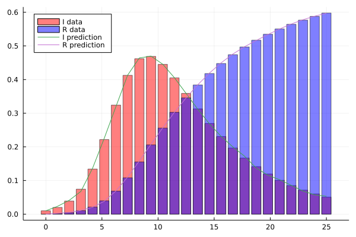

# Integrating neural networks in compartment based models


## Introduction

In this example, we will generate data from a 5 compartment model: Susceptible -> Infected -> Recovered -> Hospitalized -> Deaths. Following this, we will construct a Universal Differential Equation (UDE) by replacing each interaction term with a neural network. We will show the training and estimation using such a model. This examples demonstrates the following 3 things:

- How to write a code which integrates neural networks with ODEs in Julia?
- How to optimize the neural network parameters and train the resulting UDE?
- Such a neural network assisted ODE framework has wide range of applications ranging from quarantine diagnosis (https://www.sciencedirect.com/science/article/pii/S2666389920301938), early reopening (https://spj.sciencemag.org/journals/hds/2021/9798302/) and virtual virus spread (https://www.sciencedirect.com/science/article/pii/S2666389921000349).

## Libraries

```julia
using JLD, Lux, DiffEqFlux, DifferentialEquations, Optimization, OptimizationOptimJL, Random, Plots
```
## Data Generation
Generate data which simulates a Susceptible-> Infected -> Recovered -> Hospitalized -> Death scenario.

```julia
N_days = 25

const S0 = 1.
u0 = [S0*0.99, S0*0.01, 0., 0., 0.]

p0 = Float64[
    0.85, # τSI
    .1, # τIR
    .05, # τID
    .025, # τIH
    .02, # τHR
    .002 # τHD
    ]

tspan = (0.0, Float64(N_days))
datasize = N_days
t = range(tspan[1],tspan[2],length=datasize)

function SIRHD!(du, u, p, t)
    (S,I,R,H,D) = u
    # Making sure transfer rates positive
    (τSI, τIR, τIH, τID, τHR, τHD ) = abs.(p)
    du[1] =  - τSI*S*I# S
    # Q: Should transfer from I to T be divided by N_pop?
    # Raj divided by N_pop. When do you do that?
    du[2] = τSI*S*I - (τIR + τIH + τID )*I # I
    du[3] = τIR*I + τHR*H  # R
    du[4] = τIH*I  - (τHR + τHD)*H # H
    du[5] = τID*I + τHD*H  # D
end

prob = ODEProblem(SIRHD!, u0, tspan, p0)

sol = Array(solve(prob, Tsit5(), u0=u0, p=p0, saveat=t))
```

## Visualize the data
```julia
plot(sol[1,:], label = "Susceptible")
plot!(sol[2,:], label = "Infected")
plot!(sol[3,:], label = "Recovered")
plot!(sol[4,:], label = "Hospitalized")
plot!(sol[5,:], label = "Deaths")
```


## Constructing a Universal Differential Equation (UDE)
The simplest UDE we can construct is by replacing every interaction term in the SIRHD model with a neural network. We will use the Lux interface in Julia to define the neural networks.

```julia
p0_vec = []

NN1 = Lux.Chain(Lux.Dense(2,10,relu),Lux.Dense(10,1))
p1, st1 = Lux.setup(rng, NN1)

NN2 = Lux.Chain(Lux.Dense(1,10,relu),Lux.Dense(10,1))
p2, st2 = Lux.setup(rng, NN2)

NN3 = Lux.Chain(Lux.Dense(1,10,relu),Lux.Dense(10,1))
p3, st3 = Lux.setup(rng, NN3)

NN4 = Lux.Chain(Lux.Dense(1,10,relu),Lux.Dense(10,1))
p4, st4 = Lux.setup(rng, NN4)

NN5 = Lux.Chain(Lux.Dense(1,10,relu),Lux.Dense(10,1))
p5, st5 = Lux.setup(rng, NN5)

NN6 = Lux.Chain(Lux.Dense(1,10,relu),Lux.Dense(10,1))
p6, st6 = Lux.setup(rng, NN6)

p0_vec = (layer_1 = p1, layer_2 = p2, layer_3 = p3, layer_4 = p4, layer_5 = p5, layer_6 = p6)
p0_vec = Lux.ComponentArray(p0_vec)


function dxdt_pred(du, u, p, t)
    (S,I,R,H, D) = u

    NNSI = abs(NN1([S,I], p.layer_1, st1)[1][1])
    NNIR = abs(NN2([I], p.layer_2, st2)[1][1])
    NNID = abs(NN3([I], p.layer_3, st3)[1][1])
    NNIH = abs(NN4([I], p.layer_4, st4)[1][1])
    NNHR = abs(NN5([H], p.layer_5, st5)[1][1])
    NNHD = abs(NN6([H], p.layer_6, st6)[1][1])


    du[1] = dS = -NNSI
    du[2] = dI = NNSI - NNIR - NNID - NNIH
    #The below is the problematic one!
    #du[2] = dI = 0.01*NNSI - NNIR - NNIH - NNID
    du[3] = dR = NNIR + NNHR
    du[4] = dH = NNIH - NNHR - NNHD
    #du[4] = dH = NNIH - NNHD - NNHR
    du[5] = dD = NNID + NNHD
end

α = p0_vec

prob_pred = ODEProblem{true}(dxdt_pred,u0,tspan)

function predict_adjoint(θ)
  x = Array(solve(prob_pred,Tsit5(),p=θ,saveat=t,
                  sensealg=InterpolatingAdjoint(autojacvec=ReverseDiffVJP(true))))
end

## Since typically only infected and recovered data is available, we will use that to define our loss function
function loss_adjoint(θ)
  x = predict_adjoint(θ)
  loss =  sum( abs2, (Infected_Data .- x[2,:])[2:end])
  loss += sum( abs2, (Recovered_Data .- x[3,:])[2:end])
  return loss
end

iter = 0
function callback(θ,l)
  global iter
  iter += 1
  if iter%10 == 0
    println(l)
  end
  return false
end


##Optimization of neural network parameters

###If the loss is stagnant or shoots to a very high value, the optimizer is stuck in a minima. To avoid this, you will need to run the code again so that the neural networks are initialized differently.
### We will have a tutorial on neural network robustness, to ensure that a large number of initializations actually converge.
adtype = Optimization.AutoZygote()
optf = Optimization.OptimizationFunction((x,p) -> loss_adjoint(x), adtype)
optprob = Optimization.OptimizationProblem(optf, α)
res1 = Optimization.solve(optprob, ADAM(0.0001), callback = callback, maxiters = 15000)
```

## Visualizing the predictions
```julia
data_pred = predict_adjoint(res1.u)
plot( legend=:topleft)

bar!(t,Infected_Data, label="I data", color=:red, alpha=0.5)
bar!(t, Recovered_Data, label="R data", color=:blue, alpha=0.5)

plot!(t, data_pred[2,:], label = "I prediction")
plot!(t, data_pred[3,:],label = "R prediction")
```


## Discussion
The fitted model can be seen to give a good fit both to the training data. The training iterations also proceed very fast. We will also have a tutorial to cover forecasting and why UDE forecasting is much better than Neural ODE forecasting.s
